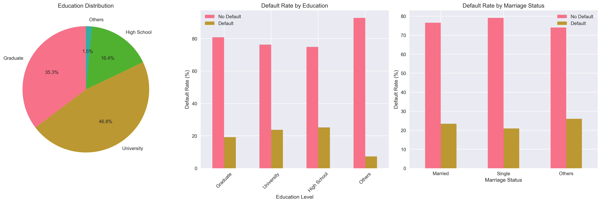
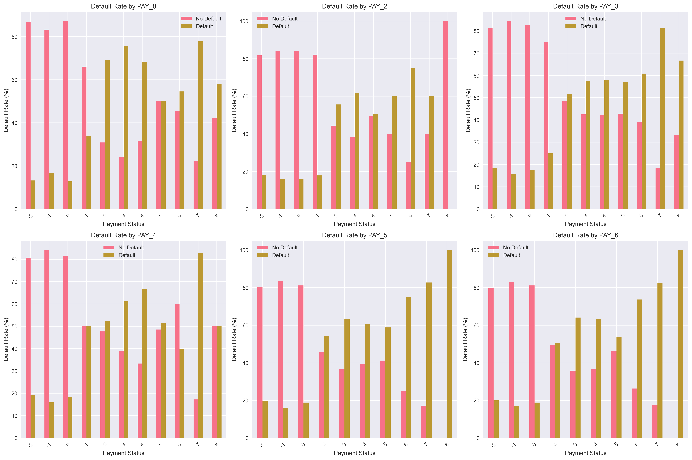
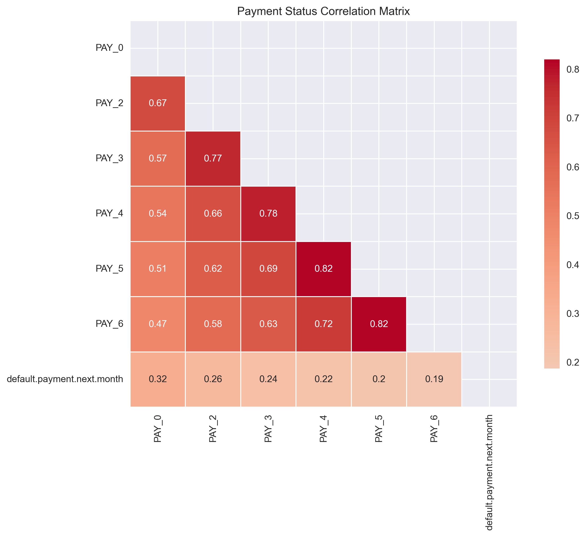

# **💳 Credit Card Default Prediction**

## **Project Overview**

This project focuses on building robust machine learning models to predict the likelihood of credit card default for the upcoming month. Leveraging a real-world dataset of credit card clients, the pipeline encompasses data loading and cleaning, extensive exploratory data analysis (EDA), feature engineering, model training with advanced techniques like SMOTE and class weighting, and comprehensive model evaluation.

The primary goal is to assist financial institutions in making informed decisions, minimizing financial risk, and optimizing credit allocation by identifying high-risk customers proactively.

## **🌟 Business Context & Impact**

In the dynamic landscape of consumer finance, accurate credit risk assessment is paramount. A high default rate can lead to significant financial losses for banks and credit card companies. This project addresses this critical business problem by:

* **Risk Mitigation**: Identifying potential defaulters *before* they default, allowing for early intervention strategies (e.g., tailored payment plans, credit limit adjustments).  
* **Optimized Credit Allocation**: Enabling smarter lending decisions by better understanding the factors that contribute to default, thus allocating credit to more reliable customers.  
* **Enhanced Profitability**: Reducing write-offs and improving collection rates, directly impacting the financial health of the institution.  
* **Regulatory Compliance**: Contributing to more robust risk management frameworks, which is often a regulatory requirement.

## **📊 Data Exploration & Key Insights (EDA)**

The initial phase involved a thorough exploratory data analysis (EDA) to understand the dataset's structure, identify patterns, and uncover potential relationships between features and the target variable (default.payment.next.month).

### **Dataset Snapshot**

* **Shape**: The dataset comprises 30,000 samples and 24 features (columns).  
* **Missing Values**: Crucially, **no missing values were found** after initial cleaning steps, ensuring data integrity.  
* **Memory Usage**: The dataset is relatively lightweight, consuming approximately 5.49 MB of memory.

### **Target Variable Analysis: The Imbalance Challenge**

A key finding during EDA was the significant class imbalance in our target variable:

* **Default Rate**: Only 22.12% of clients defaulted.  
* **Default Cases**: 6,636 instances.  
* **Non-Default Cases**: 23,364 instances.


This imbalance is typical in real-world fraud or default prediction scenarios and necessitates specialized handling (like SMOTE and class weighting) to prevent models from simply predicting the majority class and achieving deceptively high accuracy.

* **Distribution of Default Payment Next Month**:  
  (This plot clearly shows the disparity between "No Default" and "Default" cases.)

### **Demographic Analysis**

Analyzing demographic features provided valuable insights into different customer segments:

#### **Gender (SEX)**

* **Distribution**: Males (39.6%) and Females (60.4%) are present in a roughly 2:3 ratio.  
* **Default Rates**: Default rates in Males is (\~33%) and (~28%) among females, indicating that gender alone might not be a strong predictor of default.


#### **Education (EDUCATION)**

* **Categories**: The data includes various education levels, which were mapped for consistency (Graduate School, University, High School, Others).  
* **Default Rates**:  
  * Graduate School and University have the lowest default rates.  
  * High School has a slightly higher default rate.  
  * The Others category (including unknown/unclassified levels) shows the highest default rate, suggesting that incomplete or uncategorized education information could be a risk indicator. This highlights a potential area for further investigation or data quality improvement.

#### **Marriage Status (MARRIAGE)**

* **Categories**: Married, Single, Others (including unknown/unclassified).  
* **Default Rates**:  
  * Single individuals tend to have a slightly lower default rate compared to Married individuals.  
  * The Others category again exhibits a considerably higher default rate, similar to the EDUCATION feature. This pattern (higher default rates in "Others" categories) is a strong signal for potential feature engineering or data quality improvements, possibly by imputing or re-categorizing these 0 or Other values.





* **Demographic Feature Distributions**:  
  (This plot visualizes gender, education, and marriage distributions alongside default rates for each category.)


### **Payment Behavior Analysis**



Analyzing past payment statuses (PAY\_0 to PAY\_6) and bill/payment amounts revealed critical patterns:
Clients with a payment status of
-2: Typically means "No credit limit used" or "Account inactive"
-1: Usually means "Paid in full" or "Current/No balance"
0: "Current" - payment made on time
1: "Delay payment for one month" or higher (more severe delays) exhibit significantly higher default rates.

Similarly, for all Pay, customers with negative payment status (-2, -1) have very high default rates (80-90%). Current payers (0) have much lower default rates. Default rates generally increase as payment delays increase (1-8 months past due). The pattern is consistent across all time periods.

* **PAY\_0 (Previous Month Payment Status)**: A strong correlation exists between late payment in the previous month and defaulting in the next month. This heatmap shows correlations between payment statuses across different months (PAY_0 through PAY_6) and the target variable (default.payment.next.month). Strong positive correlations (0.6-0.8) between consecutive payment periods, indicating payment behavior consistency. Correlations decrease as time periods get further apart and all payment variables show positive correlation with default probability (0.19-0.32). Also, earlier payment history (PAY_0) has stronger correlation with default than older history. This suggests that recent payment behavior is more predictive of future default than historical payment patterns.




* **Bill Amounts (BILL\_AMT1-6) and Payment Amounts (PAY\_AMT1-6)**: These features show the financial activity of the client.  
  * Clients with higher bill amounts and consistently lower payment amounts relative to their bills are at higher risk.  
  * A noticeable pattern is that individuals who defaulted tend to have lower PAY\_AMT for higher BILL\_AMT compared to non-defaulters.  
  * Feature engineering opportunities here include creating ratios (payment-to-bill ratio), or analyzing trends in bill/payment amounts over time.


### **Hypothesis Formation & Feature Engineering Ideas**

Based on the EDA, several hypotheses emerged, pointing towards potential factors that predict default:

* **Hypothesis 1: Past Payment Behavior is Key.** Customers who have previously defaulted or been significantly late on payments (PAY\_X features) are highly likely to default again.  
  * **Feature Engineering Idea:** Create features that capture the *severity* and *frequency* of past late payments (e.g., number of months with 2+ month delay, average delay duration).  
* **Hypothesis 2: Financial Strain Impacts Default.** Customers with high LIMIT\_BAL but consistently high BILL\_AMT and low PAY\_AMT are at higher risk.  
  * **Feature Engineering Idea:** Create utilization ratios (BILL\_AMT / LIMIT\_BAL), debt-to-income proxies, or payment-to-bill ratios. Analyze the trend of these ratios over the past 6 months.  
* **Hypothesis 3: "Unknown" Categories are Red Flags.** Instances with EDUCATION or MARRIAGE coded as 0 or Other indicate a higher propensity to default.  
  * **Feature Engineering Idea:** A binary flag for "unknown" category might be useful. Alternatively, these could be imputed, but the current finding suggests they carry predictive power as a distinct group.  
* **Hypothesis 4: Age and Credit Limit Influence Risk.** While not explicitly detailed in the snippet, typically younger or older age groups, or individuals with unusually low/high credit limits for their demographic, might represent higher risk segments.  
  * **Feature Engineering Idea:** Binning AGE into categories (young, middle-aged, senior) and exploring interaction terms between LIMIT\_BAL and AGE or EDUCATION.

## **🛠️ Project Structure & Technologies**

The project is structured into modular Python scripts for clarity and maintainability:

```console
credit-card-default-prediction/  
├── data/                    \# Raw and processed datasets  
│   ├── raw/  
│   └── processed/  
├── notebooks/               \# Jupyter notebooks for EDA and experimentation  
├── src/                     \# Core Python modules  
│   ├── data\_preprocessing.py  
│   ├── model\_training.py  
│   └── evaluation.py  
├── models/                  \# Trained machine learning models and scalers  
├── results/                 \# Figures (plots) and CSV outputs of model evaluations  
│   ├── figures/  
│   └── model\_comparison.csv  
├── main.py                  \# Main script to run the entire pipeline  
└── README.md                \# Project documentation
```

### **Technologies Used**

* **Python 3.x**  
* **Data Manipulation**: pandas, numpy  
* **Machine Learning**: scikit-learn, xgboost, imbalanced-learn (for SMOTE)  
* **Visualization**: matplotlib, seaborn  
* **Serialization**: joblib

## **🚀 How to Run the Project**

1. **Clone the Repository:**  
```console
git clone https://github.com/your-username/credit-card-default-prediction.git  
cd credit-card-default-prediction
```

2. **Download Data:**  
   * Obtain the default\_of\_credit\_card\_clients.csv dataset from [default_credit_card_dataset](https://www.kaggle.com/datasets/uciml/default-of-credit-card-clients-dataset).  
   * Place the default\_of\_credit\_card\_clients.csv file into the data/raw/ directory.  
3. **Set up Virtual Environment (Recommended):**  
```console
python \-m venv venv  
source venv/bin/activate  \# On Windows, use \`venv\\Scripts\\activate\`
```

4. **Install Dependencies:**  
```console
pip install \-r requirements.txt
```

5. **Run the Pipeline:**  
```console
python main.py
```

   This script will:  
   * Load and clean the data.  
   * Preprocess features (scaling).  
   * Split the data and apply SMOTE.  
   * Train Logistic Regression, Random Forest, and XGBoost models, incorporating class weights.  
   * Evaluate model performance using various metrics and save plots/results.

## **📈 Results & Evaluation**

The main.py script generates comprehensive evaluation reports and visualizations, including:

* **Classification Reports**: Precision, Recall, F1-Score for each class.  
* **Confusion Matrices**: Visual representation of true positives, true negatives, false positives, and false negatives.  
* **ROC AUC Scores**: A critical metric for evaluating classifier performance on imbalanced datasets.  
* **Model Comparison Chart**: A bar plot showing the ROC AUC scores for all trained models.

# Model Comparison

## Overall Performance Metrics

| Metric | Logistic Regression | Random Forest | XGBoost | Best Model |
|--------|-------------------|---------------|---------|------------|
| **Accuracy** | 0.6830 | **0.7922** | 0.7975 | XGBoost |
| **Precision** | 0.3736 | 0.5282 | **0.5433** | XGBoost |
| **Recall** | 0.6626 | 0.4707 | 0.4684 | Logistic Regression |
| **F1-Score** | **0.4778** | 0.4978 | 0.5031 | XGBoost |
| **Specificity** | 0.6887 | **0.8822** | 0.8897 | XGBoost |
| **AUC Score** | 0.7323 | 0.7522 | **0.7669** | XGBoost |
| **Avg Precision** | 0.4850 | 0.5077 | **0.5339** | XGBoost |

## Detailed Classification Results

### Class-wise Performance

| Model | Class | Precision | Recall | F1-Score | Support |
|-------|-------|-----------|--------|----------|---------|
| **Logistic Regression** | No Default | 0.88 | 0.69 | 0.77 | 4687 |
| | Default | 0.37 | 0.66 | 0.48 | 1313 |
| **Random Forest** | No Default | 0.86 | 0.88 | 0.87 | 4687 |
| | Default | 0.53 | 0.47 | 0.50 | 1313 |
| **XGBoost** | No Default | 0.86 | 0.89 | 0.87 | 4687 |
| | Default | 0.54 | 0.47 | 0.50 | 1313 |

### Weighted Averages

| Model | Precision | Recall | F1-Score |
|-------|-----------|--------|----------|
| **Logistic Regression** | 0.77 | 0.68 | 0.71 |
| **Random Forest** | 0.78 | 0.79 | 0.79 |
| **XGBoost** | 0.79 | 0.80 | 0.79 |

## Key Insights

- **XGBoost** achieves the highest overall performance across most metrics
- **Random Forest** and **XGBoost** show similar performance, both significantly outperforming Logistic Regression
- **Logistic Regression** has the highest recall for default detection but suffers from low precision
- All models struggle with class imbalance (4687 non-defaults vs 1313 defaults)
- **XGBoost** provides the best balance between precision and recall for default prediction

<!--
## **🔮 Future Enhancements**

* **Advanced Feature Engineering**: Explore more complex interaction terms, polynomial features, and time-series analysis for payment history.  
* **Deep Learning Models**: Experiment with Neural Networks (e.g., LSTMs for sequential payment data) for potentially higher predictive power.  
* **Hyperparameter Optimization**: Implement more exhaustive tuning strategies (e.g., GridSearchCV, Bayesian Optimization) for all models.  
* **Explainability (XAI)**: Use techniques like SHAP or LIME to explain model predictions, providing more transparency to credit officers.  
* **Deployment**: Develop a simple API or web application to serve the trained model for real-time predictions.  
* **Monitoring**: Implement a system to monitor model performance drift over time in a production environment. -->
